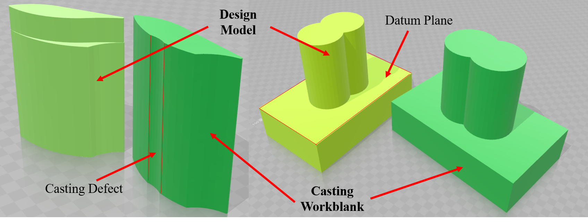

OptimalReg
===
# Overview
This repository is the implementation and experiments of "An Automated Approach for Machining Allowance Evaluation of Casting Parts".

# Implementation
The main strategy of the approach is accomplished by two stages, initial alignment and optimal registration. This two-step registration method is common in some improved ICP algorithm. The main purpose of initial alignment is finding good initial guesses so as to speed up the convergence of subsequent optimization. In this approach, a FPFH sample consensus method optimized with Levenberg-Marquardt algorithm is applied to the initial alignment. In second stage, several constraints are set according to the actual situation. Firstly, the machining allowance is not negative. The Model should be enveloped by the Data. Otherwise, the casting part would be rejected under some condition for this reason. Secondly, rough datum is used for registration feature. Planes extracted from Model and Data are aligned with point distance tolerances, which are set as additional constraints. Thirdly, the evenness of machining allowance is considered in this stage, in order to mimic the skillful operator to ``borrow" the dimension of allowance. A heuristic algorithm is applied to integrate the constraints above.

# Experiments
Due to the complex conditions of the real casting parts, the constraints cannot be obviously evaluated. Thus two pairs of design model and raw part data are created to test the validity of envelopment constraint and datum alignment constraint in the proposed method. Furthermore, the proposed approach will be carried out on turbine blade to evaluate the evenly distributed allowance constraint in this section. And the influence of the weight configurations will be also optimized. Finally, two other casting parts will be selected to verify the validity of the approach.

## Exp1-Simulations


Two created workpieces have employed the approach.


part_1


part_3

## Exp2-Experiments on turbine blade


## Exp3-Experiments on other casting parts


part_4


part_5

# Instruction
In folder [data](data/)

part_1_m.ply is model.

part_1_d.ply is original data.

part_1_d_t.ply is transformed data with Sac-IA.

## model selection
[main.m](src/main.m) is the main function.

```javascipt
test = 1; %select data

if test == 2
pointcloud1 = pcread('part_1_m.ply'); % model
pointcloud2 = pcread('part_1_d_t.ply'); % transformed data with Sac-IA (Note that the PLY is computed by PCL in C++)
pointcloud3 = pcread('part_1_d.ply'); % original data
```
## datum estimation 
datum estimated in [computeDatumCoefficients.m](src/computeDatumCoefficients.m)

```javascipt
roi = [-inf,inf;-inf,inf;-inf,10]; %place the datum in XOY plane and extract it through z axis
```

modify together with [main.m](src/main.m) line 93

```javascipt
tf1 = [eye(3) zeros(3,1); -centroid 1]; % designed datum in z, '-centroid' is replaced with 'z-centroid' 
```
## Weights

Weights can be changed in [computeFitness.m](src/computeFitness.m) Line 36-39

```javascript
    alpha = 0.1;
    beta = 0.7;
    gama = 0.9;
    probability = 0.9;
```

## Results

Result folder is created in [main.m](src/main.m) Line 4.

```javascipt
result_dir = strcat('..\results\','result19'); %create result folder
```

init.fig is initial states.

sac_ia.fig is initial guess employing Sac-IA for optimal stages.

icp.fig is approach with ICP.

final.fig is approach in this program.

ga.fig is GA process record.

